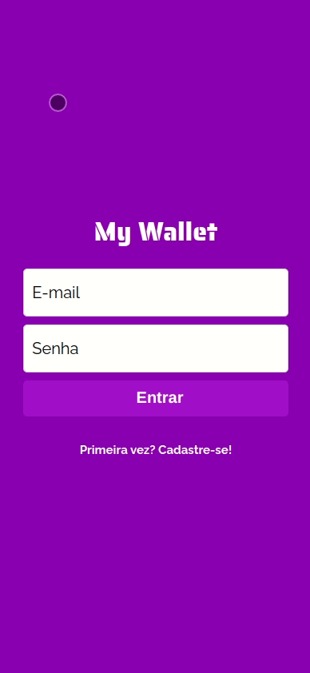

<h1>myWallet</h1>
 
 <p><b>myWallet</b> is a full-stack project. This app that allows the user to manage its earnings and expenses in a simple and aesthetically pleasant way. </p>
 <p align='center'>
  
</p>

<div style="display: flex; flex-direction: column">
 <span>Link for the deploy: https://my-wallet-6vn9218g4-onegoodgui.vercel.app/</span>
<span>Link for the API repository: https://github.com/onegoodgui/myWalletAPI</span>
 </div>

<h1> About </h1>

<p> In this app you can set daily activities and track your 'success' completing them (in time!). Below are the implemented features:</p>

<ul>
  <li> A login page, that allows you to enter your account if you have already signed up</li>
  <li> A sign-up page, where you can register an e-mail and password and create an account </li>
  <li> A page of the day, where you can check the activities you set yourself to do in the current day. In this page, you can click on the activities you have already done and mark them as completed! </li>
  <li> The day habits tracking wheel, where you can look to quickly see your progress in the day </li>
  <li> A habits page, where you can find all your activities and manage them as you wish, adding new ones or deleting some. </li>
  <li> A history page, with a full and functional calendar. You can click on past days, starting from the day you first logged in, to check which activities you completed or missed in each past day.</li>
  
 </ul>

<h1>Technologies</h1>
<p>The following tools and frameworks were used in the construction of the project:</p>


<h1> How to run </h1>

<ol>
  <li>Clone this repository</li>
  <li>Open Terminal in your code editor of preference</li>
  <li>Change the current working directory to the location where you want the cloned directory</li>
  <li>Type git clone, and then paste the URL you copied earlier.</li>
</ol>
<p>
  
``` 
git clone https://github.com/YOUR-USERNAME/YOUR-REPOSITORY 
```
</p>
<ol start='5'>
  <li>Press enter to create your local clone</li>
  <li> Open the directory where you put your cloned repository with your code editor</li>
  <li> In the terminal of your code editor, run the command below to install the necessary dependencies:</li>
</ol>

<p>
  
``` 
npm i
```
</p>

<ol start='8'>
  <li>Now, to run the code on your web browser, just type the command below:</li>
</ol>

<p>
  
``` 
npm run start
```
</p>

<ol start='9'>
  <li>Enjoy!</li>
</ol>

